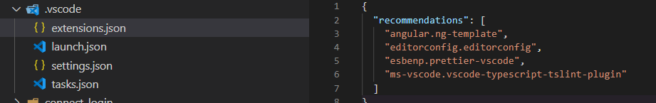

# Code Editors

## Web Editors

- [Code Sandbox](https://codesandbox.io/)
- [StackBlitz](https://stackblitz.com/)

## Visual Studio Code

### Setup as GIT editor

- [Setup VS Code as GIT editor](https://stackoverflow.com/questions/30024353/how-to-use-visual-studio-code-as-default-editor-for-git)

### Extensions

#### Extentions I use (10/2020)

```text
  Angular-BeastCode v10.0.3
  angular-schematics v4.3.0
  Angular2 v9.1.2
  AngularMaterial v10.0.0
  bracket-pair-colorizer-2 v0.2.0
  code-settings-sync v3.4.3
  code-spell-checker v1.9.2
  color-highlight v2.3.0
  dainty-dark-plus-vscode v1.0.1
  dainty-vscode v1.1.22
  debugger-for-chrome v4.12.11
  dotenv v1.0.1
  gitignore v0.6.0
  gitlens v10.2.2
  indented-block-highlighting v1.0.7
  jest-snippets v1.8.0
  markdown-all-in-one v3.3.0
  ng-template v0.1001.0
  NgRxSnippets v9.1.0
  npm-intellisense v1.3.1
  prettier-vscode v5.7.1
  project-manager v11.3.0
  quicktype v12.0.46
  remote-wsl v0.44.5
  vscode-docker v1.6.0
  vscode-icons v11.0.0
  vscode-jest-runner v0.4.24
  vscode-markdownlint v0.37.0
  vscode-node-readme v3.0.2
  vscode-npm-script v0.3.13
  vscode-readme-pattern v1.3.0
  vscode-sort-json v1.18.1
  vscode-todo-highlight v1.0.4
  vscode-typescript-tslint-plugin v1.2.3
  vscode-yaml v0.11.1
```

#### Markdown All in One

This extension is highly recommended for markup, since it auto updates table of contents, make editing easier and have shortcuts: [vs code markdown all in one](https://github.com/yzhang-gh/vscode-markdown)

#### Markdown

- Markdown auto linting extention [markdownlint by davidanson](https://github.com/DavidAnson/vscode-markdownlint.git)

#### Prettier

Use [prettier](https://prettier.io/docs/en/install.html) to follow a set of good and consistent styling rules for auto-formatting ([article: Code style matters](https://christianlydemann.com/style-angular-apps-using-prettier-and-tslint/)).

Install

```bash
npm install --save-dev --save-exact prettier
```

`.prettierrc` make this project file in root and put options here

```json
{
  "singleQuote": true
}
```

If your using TSLint and Prettier, then use [tslint-config-prettier](https://github.com/prettier/tslint-config-prettier) to make TSLint only do TS errors/warnings and Prettier only do the formatting corrections. This way TSLint don't conflict with prettier formatting.
Install and add `tslint-config-prettier` to extends in tslint.json:

```bash
npm install --save-dev tslint-config-prettier
```

`tslint.json`

```json
{
  "extends": ["tslint:recommended", "tslint-config-prettier"],
  "//": "..."
}
```

To format whole codebase easily, install prettier to dev-dependencies and add the scripts to `package.json`

```json
"scripts": {
  "//": "...",
  "prettier:test": "prettier \"**/*.{ts,html,md,scss,json}\" --list-different",
  "prettier:write": "prettier \"**/*.{ts,html,md,scss,json}\" --write"
}
```

#### Debugger for Chrome

Install `debugger-for-chrome` extension. Press F5 to start. If no launch.json file is found, it will give you an option to create it. The easiest way is to auto create a `launch` config, and just change the port. Place a breakpoint and press F5 to start the debugger.

```json
{
  // Use IntelliSense to learn about possible attributes.
  // Hover to view descriptions of existing attributes.
  // For more information, visit: https://go.microsoft.com/fwlink/?linkid=830387
  "version": "0.2.0",
  "configurations": [
    {
      "type": "chrome",
      "request": "launch",
      "name": "Launch Chrome against localhost",
      "url": "http://localhost:4200",
      "webRoot": "${workspaceFolder}"
    }
  ]
}
```

If you want to make `attach` to Chrome, you need to add `--remote-debugging-port=9222` to a Chrome shortcut. This might make your chrome login not being able to sync because testing is not allowed, so better to make a copy of your chrome shortcut, and add it here with no profile login.

### Make popup with recommended extentions for workspace installation

You can make a popup suggestion to install recommended vs code extentions for the workspace by creating a `.vscode` folder with a `extentions.json` file. In this file, just at a recommendations array with the names of the plugin.



### Make workspace vs code settings

In `.vscode` folder, make a `settings.json` file, with for example:

```json
{
  "angular.enable-experimental-ivy-prompt": false,
  "editor.codeActionsOnSave": {
    "source.fixAll.tslint": true,
    "source.organizeImports": true
  },
  "editor.defaultFormatter": "esbenp.prettier-vscode",
  "editor.formatOnSave": true,
  "files.exclude": {
    "bin/": true,
    "obj/": true,
    "*.user": true,
    "*.csproj": true
  },
  "search.exclude": {
    "**/node_modules/": true,
    "dist/": true
  },
  "typescript.tsdk": "node_modules/typescript/lib"
}
```

## Make vs code tasks

To make tasks, that can run terminal commands easy with `Terminal->Tasks` or by `F1->Tasks: Run tasks` you can create in `.vscode` folder a `tasks.json` with for example:

```json
{
  "version": "2.0.0",
  "tasks": [
    {
      "label": "Compile Solution",
      "type": "shell",
      "command": "npm run build:workbox",
      "group": "build",
      "problemMatcher": []
    },
    {
      "label": "Start Frontend Local",
      "type": "shell",
      "command": "npm run start:local",
      "presentation": {
        "group": "workbox",
        "panel": "dedicated"
      },
      "problemMatcher": []
    },
    {
      "label": "Start Elements Local",
      "type": "shell",
      "command": "npm run start:elements",
      "presentation": {
        "group": "workbox",
        "panel": "dedicated"
      },
      "problemMatcher": []
    },
    {
      "label": "Start WorkBox Local",
      "dependsOn": ["Start Frontend Local", "Start Elements Local"],
      "problemMatcher": []
    },
    {
      "label": "Generate Certificate",
      "type": "shell",
      "command": "mkcert localhost",
      "problemMatcher": []
    }
  ]
}
```
