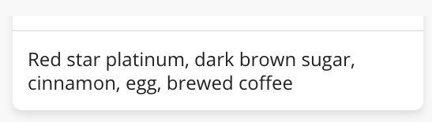

# CSS and SCSS

## Architecture

### Reset and normalize

Easy reset using [reset-css](https://www.npmjs.com/package/reset-css). Install and import `@import 'reset-css';`

```bash
npm install reset-css
```

Set global border-box and height

```scss
html {
  box-sizing: border-box;
}
*,
*:before,
*:after {
  box-sizing: inherit;
}

html,
body {
  height: 100%;
}
```

### Structuring sass projects

- [Structuring your sass projects](https://itnext.io/structuring-your-sass-projects-c8d41fa55ed4)

## Responsive

### Media-queries mixins

- [Writing media-queries with sass mixins](https://itnext.io/writing-media-queries-with-sass-mixins-3ea591ea3ea4)

## CSS GRID

- [Grid Malven - CSS Grid visual web guide](http://grid.malven.co/)

### Preventing a grid blowout

- [Preventing a grid blowout](https://css-tricks.com/preventing-a-grid-blowout/)

### Without media queries

- [Look Ma, No Media Queries! Responsive Layouts Using CSS Grid](https://css-tricks.com/look-ma-no-media-queries-responsive-layouts-using-css-grid)

### Prevent content overflow

Fix by using `max-width: 100%;` and `overflow: hidden;` on your child elements. Example:

```css
#imgEditContainer {
  display: grid;
  grid-template-columns: repeat(2, 1fr);
  column-gap: 5px;
  justify-items: center;
}

.img {
  max-width: 100%;
  max-height: 100%;
  overflow: hidden;
}
```

## Spacing in CSS

### Spacing in CSS: References

- [Spacing in CSS](https://ishadeed.com/article/spacing-in-css/)

### Margin collapse

Stick to `margin-bottom` on elements. Because if top element has `margin-bottom` and element below has `margin-top`, the largest `margin` will win and the other one be ignored. If last element should not have margin:

```css
.element:not(:last-child) {
  margin-bottom: 1rem;
}
```

If child element exists inside parrent that has `margin-bottom`, then to push down child element, use `padding-top` on the parent, to avoid ignoring child `margin-top` because of margin collapse.

### Negative Margin

If parent has margin, and child element needs to stick to edges of parent, use `negative margins`.

```css
.parent {
  padding: 1rem;
}

.child {
  margin-left: -1rem;
  margin-right: -1rem;
  margin-top: -1rem;
}
```

To make a card, with padded text but border to the edge, use a combination of `padding` and `negative margin`.



```css
.card__meta {
  padding: 10px 10px 0 10px;
  border-top: 1px solid #e9e9e9;
  margin: 0 -10px;
}
```

### Padding not working

Padding only works on `display: inline-block`. Elements like `<span>`, `<a>` that has `display: inline` has no effect. So change the `display` property to have effect:

```css
.element span {
  display: inline-block;
  padding-top: 1rem;
  padding-bottom: 1rem;
}
```

### CSS Grid gap

Add CSS Grid gap using `grid-gap`.

```css
.element {
  display: grid;
  grid-template-columns: 1fr 1fr;
  grid-gap: 16px; /* Adds gap of 16px for both rows and columns */
}
```

.. or more specific

```css
.element {
  display: grid;
  grid-template-columns: 1fr 1fr;
  grid-row-gap: 24px;
  grid-column-gap: 16px;
}
```

!> CSS Flexbox currently only supports `gap` in Firefox.

## Tips and tricks

### Control scroll in elements

Set overflow: hidden on body, to stop scroll set on body.

```css
body {
  overflow: hidden;
}
```

Add `overflow: auto` on parent element of the element that should have scroll. If using angular components, use :host to set overflow on the host div:

```scss
:host {
  overflow: auto;
}

.container {
  height: 5000px;
}
```
