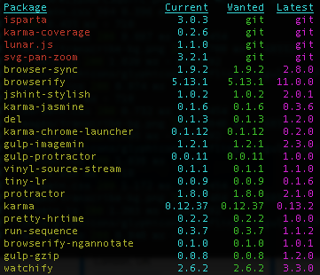

# NPM

## Setting variables in npm scripts for different environments (mac, windows etc.)

- cross-env [link](https://www.npmjs.com/package/cross-env)

cross-env makes it so you can have a single command without worrying about setting or using the environment variable properly for the platform. Just set it like you would if it's running on a POSIX system, and cross-env will take care of setting it properly.

It's not just for less code, it's also to protect against weird errors, such as since set variable will create a space in the end on mac, therefor make wrong url if using the manual seperate way.

Real world example:

```json
    # old seperate
    "build:windows": "set DEPLOY_URL=%npm_config_deploy_url% && ng build --configuration=production --no-progress --deploy-url %npm_config_deploy_url% && ng build elements --configuration=production --no-progress",
    "build:mac": "DEPLOY_URL=$npm_config_deploy_url ng build --configuration=production --no-progress --deploy-url $npm_config_deploy_url && ng build elements --configuration=production --no-progress",

    # new combined
    "build": "cross-env DEPLOY_URL=%npm_config_deploy_url% ng build --configuration=production --no-progress --deploy-url %npm_config_deploy_url% && ng build elements --configuration=production --no-progress",
```

## Node_module Clean Install (normally used by devops pipeline, but can be used locally)

Remove node modules, install again, not updating package.lock: run npm (ci = clean install)

```bash
npm ci
```

## Global packages

To see a list of globally installed packages use

```bash
npm list -g --depth 0
```

To remove a global package use

```bash
npm uninstall -g moment
```

## Remove not listed packages

Remove packages not listed in package.json

```bash
npm prune
```

## Go to package repository

Open repository home on github

```bash
npm repo your-package
```

## Versions and Updating

Always check the `CHANGELOG.md` of a repository before upgrading. Using `npm repo your-package` to get to it fast.

Versions:

- A semver / semantic versioning: Given a version number MAJOR.MINOR.PATCH, increment the:
  - MAJOR version when you make incompatible API changes,
  - MINOR version when you add functionality in a backwards compatible manner, and
  - PATCH version when you make backwards compatible bug fixes.
- `~` update all future **patch** versions
- `^` update all future **minor** versions. This is normally used.

List current packages and new versions. If `Current` and `Wanted` is different, they can be updated.

```bash
npm outdated
```



Update all packages accordingly to the package.json and `^` and `~`

```bash
npm update
```

If you are using the caret `^` in front of your versions in package.json, the major versions will not be updated (hence the yellow rows). This is good, cause there might be breaking changes updating to a new major version.

Update a dependency to their latest version.

```bash
npm i the-package@latest
```

blindly auto update all to the latest version. I don't recommend using this, since it can lead to snow ball effect of errors down the line of breaking changes.

```bash
npx npm-update-all
```

## CHANGELOG.MD generator

- [Standard Version](https://github.com/conventional-changelog/standard-version)

## NPM trends

See [NPM Trends](https://www.npmtrends.com) for npm trends.
